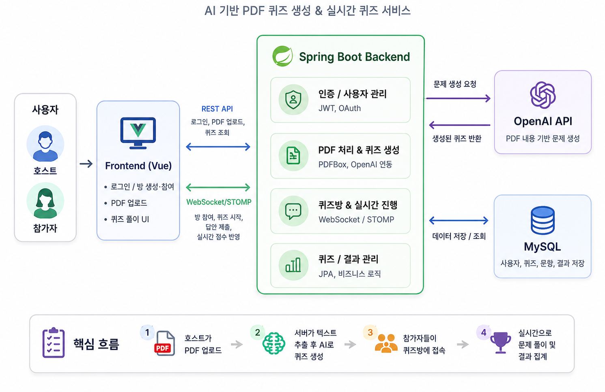

# QuizJam 🎯
AI 기반 PDF 퀴즈 생성 & 실시간 퀴즈 서비스

---

## 🔥 프로젝트 소개

QuizJam은 호스트가 PDF 문서를 업로드하면 서버가 텍스트를 추출하고,
OpenAI API를 활용해 퀴즈를 자동 생성하는 **실시간 학습 보조 서비스**입니다.

생성된 퀴즈는 퀴즈방에서 여러 참가자가 함께 풀 수 있으며,
문제 진행과 답안 제출, 결과 반영은 WebSocket/STOMP 기반으로 처리합니다.

- OpenAI 기반 퀴즈 자동 생성
- 실시간 퀴즈방 생성 및 참여

---

<h2>🎥 시연 영상 (Click!)</h2>

---

## 🧩 아키텍처 다이어그램

- **Frontend (Vue)**: 사용자 화면, PDF 업로드, 퀴즈 풀이
- **Backend (Spring Boot)**: 인증, PDF 처리, 퀴즈 생성, 데이터 관리
- **OpenAI API**: PDF 기반 문제 생성
- **MySQL**: 사용자/퀴즈/문항/결과 저장

---

## 🚀 주요 기능

- 📄 PDF 업로드 및 PDFBox 기반 텍스트 추출
- 🤖 OpenAI 기반 퀴즈 자동 생성
- 🧠 객관식 / 단관식 / OX 문제 생성
- 🏠 퀴즈방 생성 및 참가자 참여
- ⚡ **WebSocket/STOMP 기반 실시간 퀴즈 진행
- 📊 퀴즈·문항·결과 데이터 저장 및 조회
- 🔐 JWT 기반 인증 및 카카오 OAuth 로그인

---

## 🛠 기술 스택

### ⚙️ Language / Backend

### 🗄️ Database / ORM

### 🤖 AI / PDF

### ⚡ Realtime

---

### PDF 입력 길이 제어 문제
- **문제**: 대용량 PDF를 그대로 프롬프트에 포함하면 토큰 수가 과도하게 증가해 응답 지연 또는 요청 실패 가능성이 있었습니다.
- **해결**:
    - PDF 전체 텍스트를 추출한 뒤
    - 프롬프트 지시문 토큰 수를 먼저 계산하고
    - 남은 토큰 한도에 맞춰 PDF 본문을 잘라내는 방식으로 입력 길이를 제어했습니다.

---

## 🔭 향후 개선 방향

- **긴 문서 처리 고도화**: 현재 텍스트 절단 방식에서 문서 청크 분할, 요약, 중요도 기반 추출 방식으로 개선
- **실시간 서비스 확장성 확보**: Redis Pub/Sub 기반 메시지 브로커와 방 상태 관리 도입
- **AI 응답 안정성 강화**: 응답 형식 검증, 재시도 정책, 타임아웃 및 예외 처리 고도화
- **테스트 강화**: WebSocket 실시간 흐름과 MySQL 연동을 포함한 통합 테스트 추가
- **운영 모니터링**: API 응답 시간, OpenAI 호출량, 오류율을 모니터링하는 대시보드 구성

