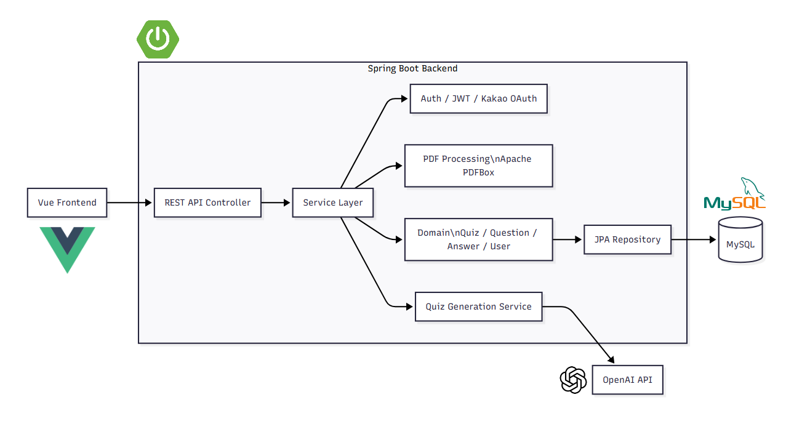

# QuizJam 🎯
AI 기반 PDF 퀴즈 생성 & 실시간 퀴즈 서비스

---

## 🔥 프로젝트 소개
QuizJam은 PDF 문서를 기반으로 AI가 퀴즈를 자동 생성하고,  
사용자가 퀴즈를 풀 수 있는 **학습 보조 서비스**입니다.

- PDF → 텍스트 추출
- AI 기반 문제 생성
- 퀴즈 데이터 관리

---

<h2>🎥 시연 영상 (Click!)</h2>

---

## 🧩 아키텍처

- **Frontend (Vue)**: 사용자 화면, PDF 업로드, 퀴즈 풀이
- **Backend (Spring Boot)**: 인증, PDF 처리, 퀴즈 생성, 데이터 관리
- **OpenAI API**: PDF 기반 문제 생성
- **MySQL**: 사용자/퀴즈/문항/결과 저장

---

## 🚀 주요 기능
- 📄 PDF 업로드 및 텍스트 추출
- 🤖 OpenAI 기반 퀴즈 자동 생성
- 🧠 객관식 / 주관식 문제 생성
- 📊 퀴즈 데이터 저장 및 조회
- 🔐 JWT 기반 인증 시스템

---

## 🛠 기술 스택

### ⚙️ Language / Backend

### 🗄️ Database / ORM

### 🤖 AI / PDF

